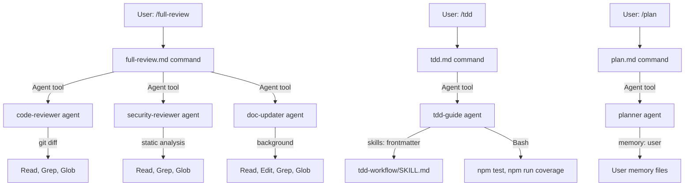

# Architecture: Command → Agent → Skill

The three-tier orchestration model that makes this setup composable without becoming bloated.

## The Three Layers

```
┌─────────────────────────────────────────────────┐
│  COMMAND layer  (/plan, /tdd, /full-review)      │
│  Entry points. User-invocable. Orchestrate agents.│
└────────────────────────┬────────────────────────┘
                         │ invokes via Agent tool
                         ▼
┌─────────────────────────────────────────────────┐
│  AGENT layer  (planner, tdd-guide, debugger)     │
│  Single-responsibility subprocesses.             │
│  Scoped tools. Explicit model. One job.          │
└────────────────────────┬────────────────────────┘
                         │ loads via skills: frontmatter
                         │ or Skill tool
                         ▼
┌─────────────────────────────────────────────────┐
│  SKILL layer  (tdd-workflow, coding-standards)   │
│  Knowledge packs. No behavior — only context.    │
│  Load only when the agent actually needs them.   │
└─────────────────────────────────────────────────┘
```

### Layer 1: Commands

Commands are markdown files in `~/.claude/commands/` or `.claude/commands/`. They become slash commands (`/plan`, `/tdd`, `/verify`).

**What commands do:**
- Accept arguments from the user (`$ARGUMENTS`)
- Orchestrate one or more agents in sequence
- Handle checkpoints and user confirmation gates
- Write state to files when multi-step (e.g. `full-stack-feature` uses `.full-stack-feature/state.json`)

**What commands don't do:**
- Implement anything directly (that's agents)
- Load skills (that's agents)
- Run in the background

### Layer 2: Agents

Agents are markdown files with YAML frontmatter in `~/.claude/agents/`. Claude Code launches them as subprocesses with their own context window.

**Frontmatter fields that matter:**

```yaml
---
name: planner
description: >
  Produce phase-wise gated plans. Used before any multi-file task.
tools:
  - Read
  - Grep
  - Glob
  - WebSearch
model: opus          # override per-agent — planner uses Opus, doc-updater uses Haiku
memory: user         # access user memory files
skills:
  - tdd-workflow     # preloaded into this agent's context at launch
background: true     # runs without blocking the main session
---
```

**Single-responsibility rule:** Each agent does exactly one thing and reports back. The `debugger` diagnoses — it never implements. The `refactorer` changes structure — it never changes behavior. Mixing responsibilities creates god agents that are hard to reason about and easy to misuse.

**Tool scoping:** Each agent declares only the tools it needs. The `code-reviewer` only needs `Read`, `Grep`, `Glob`, and `Bash(git diff *)`. It cannot write files — by design. Narrow tool lists prevent agents from taking unintended actions.

### Layer 3: Skills

Skills are markdown files in `~/.claude/skills/<skill-name>/SKILL.md`. They are knowledge packs — not code, not behavior, just context that loads into an agent's prompt.

**Two loading modes:**

```
Mode 1 — Agent-preloaded:
  Agent's frontmatter has `skills: [tdd-workflow]`
  → SKILL.md loads into the agent's context when the agent launches
  → Agent has this knowledge for the entire conversation

Mode 2 — On-demand via Skill tool:
  Agent or Claude calls Skill tool with the skill name
  → SKILL.md loads into the current context on demand
  → Only costs tokens when actually needed
```

**Why skills are separate from agents:** A skill is reusable knowledge that multiple agents can load. The coding-standards skill can be loaded by the code-reviewer, the refactorer, or directly in the main session. If it lived inside one agent's system prompt, it would be duplicated across every agent that needs it.

---

## Why This Hierarchy Exists

### Separation of concerns

Each layer has a clear job:
- Commands know *what workflow to run*
- Agents know *how to do one specific thing*
- Skills know *domain knowledge about how to do it well*

Without this separation, you get god agents: single files that orchestrate, implement, review, and apply domain knowledge all at once. God agents are long, expensive to load, and impossible to test in isolation.

### Token efficiency

```
Without the hierarchy:
  One large agent loaded every session
  → 5,000 tokens in context even when you're writing a README

With the hierarchy:
  Agents load only when invoked
  Skills load only into the agents that need them
  → 0 tokens for agents/skills when not in use
```

### Composability

Commands mix and match agents. `/full-review` runs `code-reviewer` + `security-reviewer` + `doc-updater` in sequence — three agents with separate concerns, orchestrated by one command. Add a new agent and it can immediately participate in any command that needs it.

---

## How Agents Call Each Other

Agents invoke other agents via the **Agent tool**, never via bash:

```
✅ Correct:
  /full-review command → launches code-reviewer agent via Agent tool
                       → launches security-reviewer agent via Agent tool

❌ Wrong:
  /full-review command → bash: "claude -p 'review this code'"
```

The Agent tool gives each subagent its own context window. Bash subprocess calls would inherit the parent context, lose the ability to pass structured results, and break the permission model.

---

## Mermaid Diagram



---

## Asymmetric Persona Strategy

Agent system prompt bodies are calibrated by task type, based on Hu et al. (2026) research showing that persona effects are **asymmetric** — helpful for some tasks, harmful for others.

| Task type | What it covers | Persona strategy | Why |
|-----------|---------------|------------------|-----|
| **Pretraining** | Code logic, debugging, refactoring, test writing | None (empty body) | Model already trained on these skills. Persona redirects attention away from the problem. |
| **Alignment** | Documentation style, UI/UX aesthetics, tone matching | Short (1–2 sentences) | Behavioral calibration needed. Persona establishes the right prior. |
| **Safety** | Security analysis, threat modeling, vulnerability detection | Full (50+ words) | +17.7% refusal rate vs. no persona. Explicit auditor framing activates adversarial reasoning. |
| **Mixed** | Planning, multi-step reasoning | Minimum (behavioral constraint only) | Neutral effect. Constraint prevents over-confidence; full persona adds noise. |

**Classification for new agents:** Ask which layer the task primarily lives in:
- Does the model already know how to do this well from pretraining? → No persona.
- Does the task require a specific tone, style, or aesthetic register? → Short persona.
- Does the task involve evaluating risk, security, or safety-sensitive content? → Full persona.
- Does the task mix reasoning with output formatting? → Behavioral constraint only.

The key distinction: a **behavioral constraint** (e.g., "require user confirmation before implementing") tells the agent what NOT to do — this is neutral regardless of task type. A **persona** (e.g., "You are an expert reviewer") tells the agent who to BE — this is where the asymmetry kicks in.

---

## Project-Level Overrides

The global `~/.claude/` config is the baseline. Projects override by adding a `.claude/` directory to the project root:

```
project-root/
├── .claude/
│   ├── settings.json    # adds/removes permissions, enables project MCPs
│   ├── agents/
│   │   └── tdd-guide.md # override global tdd-guide with Go test runner
│   └── CLAUDE.md        # project-specific context (stack, test commands)
└── src/
```

Rules of override:
1. Project agents shadow global agents by the same `name:`
2. Project settings merge with global (project `allow` adds to global `allow`)
3. Project CLAUDE.md loads in addition to global CLAUDE.md — both are active
4. Use `/new-project` to scaffold the project `.claude/` structure correctly
